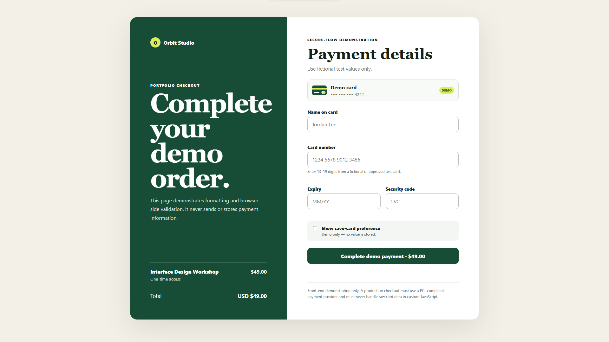
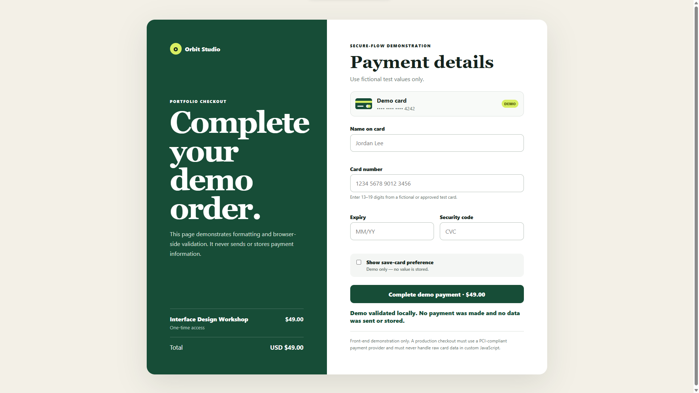

# Payment Form — Front-End Demo

An accessible, responsive checkout interface built with plain HTML, CSS, and JavaScript.

## Live demo

[Open the deployed payment-form demo](https://hashemquraan-402.github.io/payment-form-frontend-demo/)

## Screenshots

### Checkout interface



### Local validation



## Features

- Card-number grouping
- Expiry and security-code formatting
- Native required-field validation
- Luhn validation for fictional or provider-approved test card numbers
- Expiry-date checks
- Visible, accessible field errors and status feedback
- Responsive two-panel layout
- No framework or build step

## Demo test values

Use test values only. Never enter real payment information.

- **Name:** `Jordan Lee`
- **Card number:** `4242 4242 4242 4242`
- **Expiry:** any future month and year, such as `12/30`
- **Security code:** any 3 or 4 digits, such as `123`

## Run locally

Open `index.html` directly, or serve the directory:

```powershell
python -m http.server 8080
```

Then open `http://localhost:8080`.

## Safety and scope

This is a front-end portfolio demonstration. Use fictional or officially documented payment-provider test values only. The form prevents its default submission, performs checks locally, and does not transmit, process, charge, or store card data. The “save-card” control is also visual only.

A production payment flow must use a PCI-compliant payment provider and provider-hosted fields or tokenization. Raw card information must never be sent to or logged by custom application code.

## Deploy

The project is static and can be published with GitHub Pages or another static host. On GitHub Pages, select the `main` branch and repository root under **Settings → Pages**.

